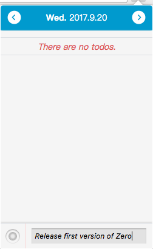
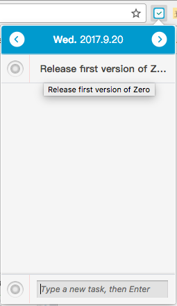
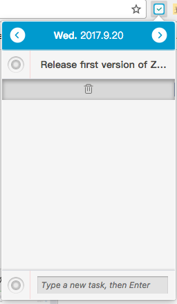

# Zero

An light chrome extension to manage daily TODO list.

Zero is writeen with Vue2, and build by webpack.The whole files are build in folder `zero`.

## Features

* New a TODO;
* Change the status of TODO;
* Store historical TODO List;
* Delete a TODO.

## Screen shots

## Install

1.Clone the code
> $ git clone git@github.com:zollero/zero.git

2.Download the node modules
> $ cd zero && npm install

3.Build App and watch files change
> $ npm run build

## Change Log

### v0.0.2 (2017-09-19) [Release](https://github.com/zollero/zero/releases/tag/v0.0.2)

* New a TODO;
* Change the status of TODO;
* Store historical TODO List;
* Delete a TODO.

## TODOs list

* Add notice to TODO;
* Change data storage style from localStorage to IndexedDB;
* Add dashboard page to show Whole data analysis.

## LICENSE

[MIT](http://opensource.org/licenses/MIT)
